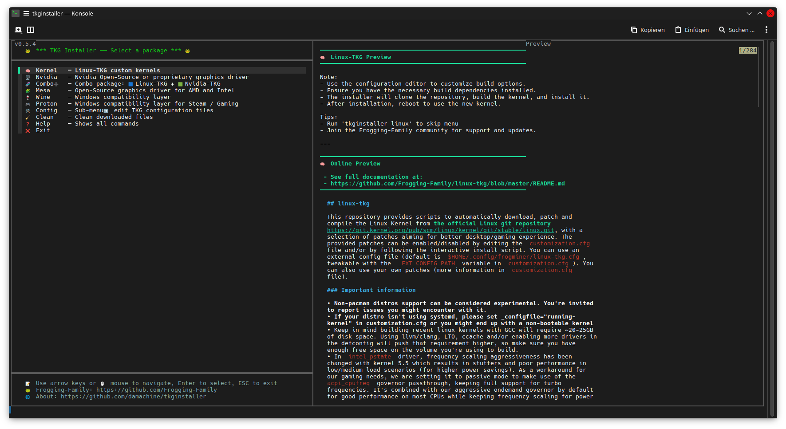

# TKG Installer 🐸

<p align="left">
  <a href="https://opensource.org/licenses/MIT"></a>
  
  <a href="https://archlinux.org/"></a>
  <a href="https://app.codacy.com/gh/damachine/tkginstaller/dashboard?utm_source=gh&utm_medium=referral&utm_content=&utm_campaign=Badge_grade"></a>
</p>

---

## ⭐ Features
- **Manage the popular TKG packages `Kernel`, `Nvidia`, `Mesa`, `Wine`, `Proton` from the [Frogging-Family](https://github.com/Frogging-Family) repositories.** 
- **Fuzzy finder `fzf` for the interactive menu.**
- **Provides an quick command-line mode.**
- **Edit the TKG package configuration files in `~/.config/frogminer/`.**
- **Optional download config files in `~/.config/frogminer/` folder.**
- **Split window with preview.** ***(Beta)***

<div align="center">
  
</div>

[🎬 Demo-Video](images/tkginstaller.gif)

---

## 🛠️ Installation

#### Arch Linux (Recommended)

[](https://aur.archlinux.org/packages/tkginstaller-git)

- Using an AUR helper:
  
   ```bash
   # STEP 1: Install
   yay -S tkginstaller-git
   #OR any other AUR helper

   # After installation, you can simply run:
   tkginstaller

   # Show all available commands and shortcuts (very useful!)
   tkginstaller help
   ```

- Manual installation:

   ```bash
   # STEP 1: Preparation
   mkdir -p /patch/to/tkginstaller
   cd /patch/to/tkginstaller

   # STEP 2: Download with wget
   wget https://raw.githubusercontent.com/damachine/tkginstaller/master/tkginstaller.sh
   # OR: Download with curl
   curl -O https://raw.githubusercontent.com/damachine/tkginstaller/master/tkginstaller.sh

   # STEP 3: Make script executable
   chmod +x tkginstaller.sh

   # STEP 4: Optional (Recommended)
   # Quick access: Create a system link 
   # To make the installer available system-wide, create a symlink and skip alias:
   sudo ln -s /path/to/tkginstaller.sh /usr/bin/tkginstaller
   # OR: Create a alias
   # If you installed manually, add this to your `~/.bashrc` or `~/.zshrc` for easy access:
   tkginstaller() {
      bash -c '/path/to/tkginstaller.sh'
   }
   # OR:
   alias tkginstaller="bash -c '/path/to/tkginstaller.sh'"

   # Now you can run from anywhere:
   tkginstaller
   ```

- Optional tools (Recommended):

> - **`bat`** - Alternative for "cat" with syntax highlighting.
> - **`curl`, `wget`** - Fetching preview content.
> - **`glow`** - Converts Markdown in terminal.
> - **`nano`, `vim`** - An text editor for configuration files.
> - **`onefetch`** - Git repository information display.

---

## 🚀 Usage

- #### Interactive (Menu-mode)
   ```bash
   tkginstaller
   ```

- #### Commandline (Direct-mode)

   ```bash
   # Skip the menu and run specific actions directly:
   # Examples:
   tkginstaller linux    # Install Linux-TKG
   tkginstaller nvidia   # Install Nvidia-TKG
   tkginstaller mesa     # Install Mesa-TKG
   tkginstaller wine     # Install Wine-TKG
   tkginstaller proton   # Install Proton-TKG

   # Show all available commands and shortcuts!
   tkginstaller help
   ```

---

### ⚙️ System Configuration

- Set your preferred editor via `$EDITOR` environment variable.

---

> [!TIP]
> Contribute and suggest improvements. Welcome ⭐ at **[Discussions](https://github.com/damachine/tkginstaller/discussions)**  
> If you need help, open an **[Issues](https://github.com/damachine/tkginstaller/issues)**
>
> <a href="https://github.com/damachine/tkginstaller/issues"></a>

---

## ⚠️ Disclaimer
This software is provided "as is", without warranty of any kind, express or implied.
I do not guarantee that it will work as intended on your system.

## 📄 License

This installer script is released under the **MIT License**.

[](https://opensource.org/licenses/MIT)

Individual TKG packages have their own licenses:
- See respective repositories at [https://github.com/Frogging-Family](https://github.com/Frogging-Family)

---

## 💝 Support the Project

If you find TKG Installer useful and want to support its development:

- ⭐ **Star this repository** on GitHub.
- 🐛 **Report bugs** and suggest improvements.
- 🔄 **Share** the project with others.
- 📝 **Contribute** code or documentation.
- [](https://github.com/sponsors/damachine)

> *🙏 Your support keeps this project alive and improving — thank you!.*

---

👨‍💻 Developed by **DAMACHINE** 📧 Contact: christkue79@gmail.com 🌐 Repository: [GitHub](https://github.com/damachine/tkginstaller)
