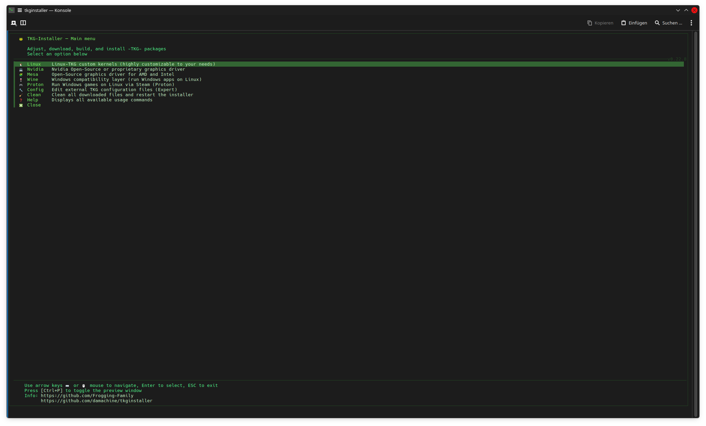
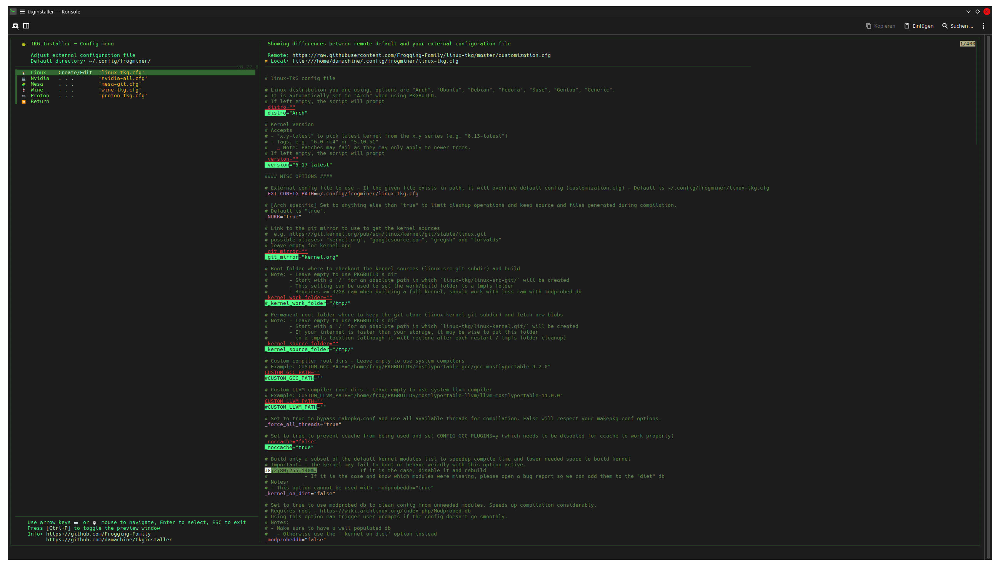
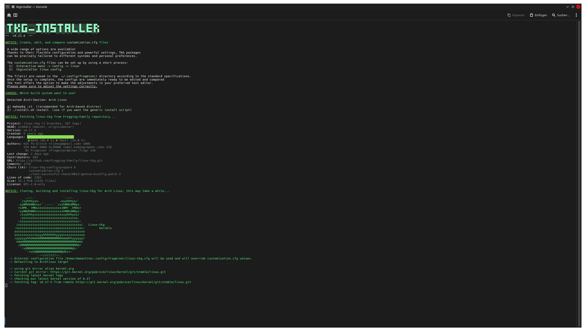
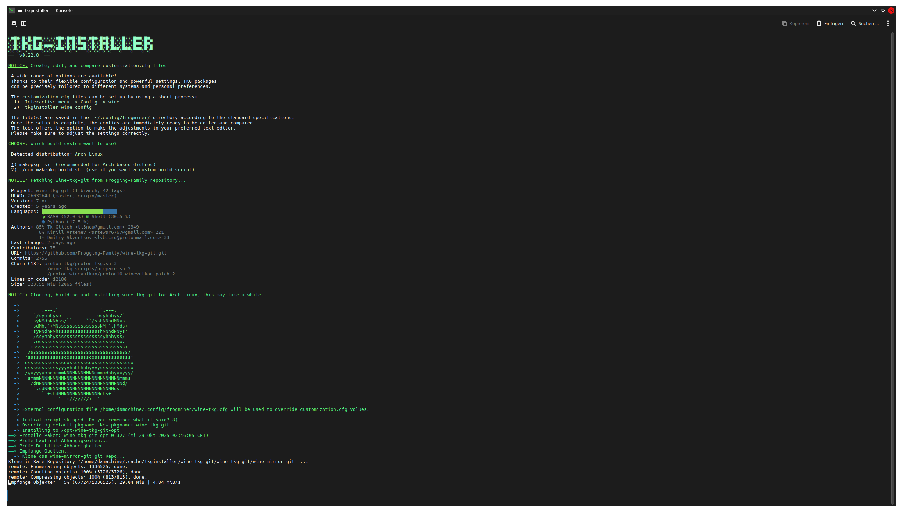

<p align="left">
  <a href="https://opensource.org/licenses/MIT"></a>
  
  <a href="https://kernel.org/"></a>
  <a href="https://app.codacy.com/gh/damachine/tkginstaller/dashboard?utm_source=gh&utm_medium=referral&utm_content=&utm_campaign=Badge_grade"></a>
</p>

---

# TKG-Installer 🐸

### Easily build the TKG packages from the [Frogging-Family](https://github.com/Frogging-Family) repositories.

---

###### This script is intended to simplify the installation and configuration of the powerful TKG packages.

###### With flexible configuration and powerful adjustment features, the TKG packages can be tailored precisely to different systems and personal needs. This versatility has made them an indispensable part of my daily routine for a long time. 

###### I've been using this script successfully for quite a while—maybe it will help you too!

---

## Features

- **Dual Mode Operation**: Use either an interactive `fzf`-menu or fast direct `command-line` mode.
- **Advanced Package Configuration**: This script can create external configuration files for all TKG packages and tools supporting the feature.
- **Multi-Distro Support**: Works seamlessly on Arch-based systems and most other Linux distributions support by the Frogging-Family.

[](images/fzf.png)
[](images/fzf2.png)
[](images/config.png)
[](images/linux.png)
[](images/wine.png)
[](images/help.png)

---

## Installation

#### Arch Linux

[](https://aur.archlinux.org/packages/tkginstaller-git)

- Using an AUR helper (Recommended):
  
   ```bash
   # STEP 1: Install
   yay -S tkginstaller-git
   #OR any other AUR helper

   # After installation, you can simply run:
   tkginstaller
   ```

#### All Distributions

- Manual installation:

   ```bash
   # STEP 1: Preparation
   mkdir -p /patch/to/tkginstaller
   cd /patch/to/tkginstaller

   # STEP 2: Download with curl
   curl -O https://raw.githubusercontent.com/damachine/tkginstaller/master/tkginstaller.sh

   # STEP 3: Make script executable
   chmod +x tkginstaller.sh
   ```
   ```bash
   # Optional: Make the installer available system-wide after manual installation

   # Method 1: Create a system link (Recommended)
   sudo ln -s /path/to/tkginstaller.sh /usr/bin/tkginstaller

   # Method 2: Create a shell alias or function
   # Add one of this to your ~/.bashrc or ~/.zshrc:

   # As alias:
   alias tkginstaller='bash -c "/path/to/tkginstaller.sh"'

   # OR as function:
   tkginstaller() {
      bash -c '/path/to/tkginstaller.sh'
   }

   # Now you can run from anywhere:
   tkginstaller
   ```

#### Dependencies
-  Command-line mode need only:
> - **`git`**: For cloning the TKG repositories.
> - **`onefetch`**: To display Git repository information like fastfetch.

- Interactive `fzf`-menu and Editor mode need:
> - **`bat`**: For syntax highlighting.
> - **`curl`**: Used to fetch configuration and markdown files.
> - **`fzf`**: Powers the interactive menu.
> - **`glow`**: For preview markdown files in the terminal.
> - **`nano`, `micro`, `vim`, etc.** The script uses the `$EDITOR` environment variable.

#### Individual TKG packages have their own dependencies: [https://github.com/Frogging-Family](https://github.com/Frogging-Family)

---

## Usage

- #### Interactive (Menu-mode)

> For a user-friendly, menu-driven experience, simply run:

>   ```bash
>   tkginstaller
>   ```

- #### Command-line (Direct-mode)

> For quick, automated tasks, use direct commands. This mode skips the interactive menu.

>   ```bash
>   # Syntax: tkginstaller [package]
>   # Use full names or shortcuts (l, n, m, w, p)
>
>   tkginstaller linux      # or 'tkginstaller l'
>   tkginstaller nvidia     # or 'tkginstaller n'
>   tkginstaller mesa       # or 'tkginstaller m'
>   tkginstaller wine       # or 'tkginstaller w'
>   tkginstaller proton     # or 'tkginstaller p'
>
>   # Syntax: tkginstaller [package] [action]
>   # Use full names or shortcuts (c, e for config/edit)
>
>   # Edit a package's configuration file:
>   tkginstaller linux config   # or 'tkginstaller l c'
>   tkginstaller config linux   # or 'tkginstaller c l'
>   tkginstaller mesa edit      # or 'tkginstaller m e'
>
>   # Clean up all temporary files and restart installer:
>   tkginstaller clean
>
>   # Use 'help' or its shortcuts (h, --help, -h)
>   tkginstaller help
>   ```

---

> [!TIP]
> ### Have a question or an idea?
> - **Suggest improvements** or discuss new features in our **[Discussions](https://github.com/damachine/tkginstaller/discussions)**.
> - **Report a bug** or request help by opening an **[Issue](https://github.com/damachine/tkginstaller/issues)**.
>
> <a href="https://github.com/damachine/tkginstaller/discussions"></a> <a href="https://github.com/damachine/tkginstaller/issues"></a>

## ⚠️ Disclaimer
This software is provided "as is", without warranty of any kind, express or implied.
I do not guarantee that it will work as intended on your system.

## 📄 License

This installer script is released under the **MIT License**.

[](https://opensource.org/licenses/MIT)

Individual TKG packages have their own licenses:
- See respective repositories at [https://github.com/Frogging-Family](https://github.com/Frogging-Family)

---

## 💝 Support the Project

If you find TKG Installer useful and want to support its development:

- ⭐ **Star this repository** on GitHub.
- 🐛 **Report bugs** and suggest improvements.
- 🔄 **Share** the project with others.
- 📝 **Contribute** code or documentation.
- [](https://github.com/sponsors/damachine)

> *🙏 Your support keeps this project alive and improving — thank you!.*

#### ⭐ Stargazers over time
[](https://starchart.cc/damachine/tkginstaller)

---

👨‍💻 Developed by **DAMACHINE** 📧 Contact: christkue79@gmail.com 🌐 Repository: [GitHub](https://github.com/damachine/tkginstaller)
